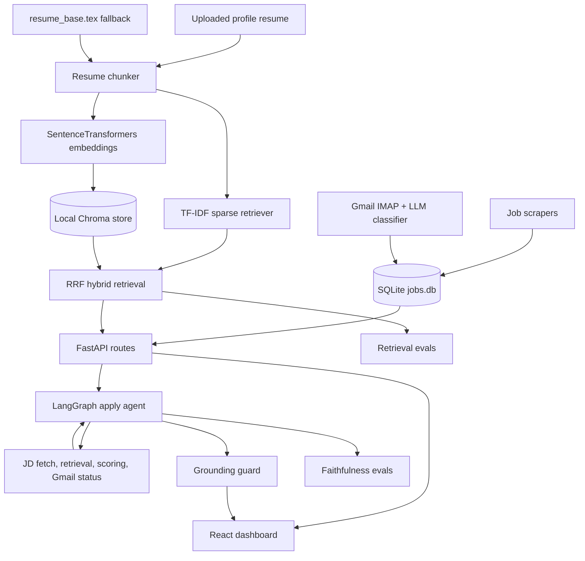

# Job Hunter

Job Hunter is a local-first application tracker that now combines scraping, Gmail status sync, hybrid resume retrieval, and a grounded LangGraph apply agent. It keeps the existing FastAPI backend, React dashboard, SQLite database, configurable OpenAI/Groq generation, and Gmail parsing, while adding agentic RAG and a reproducible evaluation harness.

## What It Does

- Scrapes jobs from Greenhouse by default, with Reed, Adzuna, Gradcracker, and Otta/WTTJ still available as optional sources.
- Lets each local user upload their own resume profile, with a `.tex` source used for RAG and generation.
- Scores jobs against the resume with hybrid retrieval: dense Chroma vectors plus a from-scratch TF-IDF sparse retriever fused by RRF.
- Runs an apply agent that extracts JD requirements, retrieves resume evidence, drafts a cover letter, and returns exact cited resume chunks.
- Tracks application replies from Gmail and updates pipeline status.
- Evaluates retrieval and generation faithfulness with `python -m evals.run`.

## Architecture



## Key Paths

| Area | Files |
|---|---|
| FastAPI routes | `server/app.py` |
| SQLite access | `server/database.py` |
| User resume profile | `server/profile_manager.py`, `dashboard/src/views/ProfileView.jsx` |
| Hybrid retrieval | `server/hybrid_retriever.py`, `server/tfidf_retriever.py`, `server/vector_store.py` |
| Resume chunking | `server/resume_chunks.py` |
| Legacy + hybrid match scoring | `server/match_engine.py` |
| LLM client | `server/llm_client.py` |
| Smart Apply | `server/apply_engine.py` |
| LangGraph apply agent | `server/job_agent.py`, `server/agent_tools.py`, `server/grounding.py` |
| Gmail sync | `server/gmail_tracker.py` |
| React dashboard | `dashboard/src/App.jsx`, `dashboard/src/components/JobRow.jsx`, `dashboard/src/components/AgentApplyPanel.jsx` |
| Evals | `evals/` |

## Run Locally

```bash
python3 -m venv .venv
source .venv/bin/activate
pip install -r requirements.txt

cp scrapers/config.example.py scrapers/config.py
# Add keys in scrapers/config.py as needed:
# OPENAI_API_KEY or GROQ_API_KEY, REED_API_KEY, ADZUNA_APP_ID, ADZUNA_APP_KEY, Gmail credentials

cd dashboard
npm install
cd ..

./run.sh
```

Dashboard: `http://localhost:5173`
API docs: `http://localhost:8000/docs`

## Resume Profile

Open **Profile** in the dashboard and upload a LaTeX resume source (`.tex`, `.latex`, or `.txt`). That uploaded source is stored locally in `data/profile/active_resume.tex` and becomes the active input for chunking, hybrid retrieval, match scoring, Smart Apply, the LangGraph apply agent, and evals. You can also attach the original resume file (`.pdf`, `.doc`, `.docx`, or `.tex`) for profile storage; the `.tex` source is what powers RAG.

## Greenhouse Setup

Greenhouse scraping uses the public Job Board API and does not need an API key for job-list GET requests. Add company board tokens to `GREENHOUSE_BOARDS` in `scrapers/config.py`; the token is the company slug in a Greenhouse board URL, for example `https://boards.greenhouse.io/stripe` uses `stripe`. The scraper calls:

```text
GET https://boards-api.greenhouse.io/v1/boards/{board_token}/jobs?content=true
```

`content=true` is important because it returns the full job description, departments, and offices in one response. Run Greenhouse-only with the dashboard's default **Greenhouse** source, or from CLI with:

```bash
cd scrapers
python main.py
```

Use `python main.py --all` only when you explicitly want Reed and Adzuna too.

## Configuration

Environment variables override `scrapers/config.py`.

| Variable | Default |
|---|---|
| `LLM_PROVIDER` | `auto` |
| `OPENAI_MODEL` | `gpt-5.4-mini` |
| `GROQ_MODEL` | `llama-3.3-70b-versatile` |
| `JUDGE_MODEL` | active provider default |
| `EMBEDDING_MODEL` | `BAAI/bge-small-en-v1.5` |
| `EMBEDDING_FALLBACK_MODEL` | `all-MiniLM-L6-v2` |
| `VECTOR_STORE_PATH` | `data/chroma` |
| `VECTOR_COLLECTION` | `resume_chunks` |
| `RETRIEVAL_METHOD` | `hybrid` |
| `RETRIEVAL_K` | `6` |
| `RRF_K` | `60` |
| `RRF_DENSE_WEIGHT` | `1.0` |
| `RRF_SPARSE_WEIGHT` | `1.0` |

## Agent Endpoint

```bash
curl -X POST http://localhost:8000/agent/apply/{job_id}
```

The response includes:

- `cover_letter`
- `requirements`
- `citations`
- `evidence`
- `unsupported_claims_removed`
- `faithfulness_score`
- `match`

The dashboard exposes this in each expanded DB-backed job row as **Agent Apply**.

## Evals

Run the full harness:

```bash
python -m evals.run
```

Outputs are written to `evals/results/<timestamp>/`:

- `retrieval_results.md`
- `retrieval_results.csv`
- `generation_faithfulness.json`
- `summary.md`
- `summary.json`

Seed labels live in `evals/dataset.jsonl`. The file includes 30 examples: 15 labelled and 15 explicit TODOs for adding ground-truth relevance labels.

Baseline local run with hosted LLM judging disabled and the local dense embedding model available:

| Method | Queries | Precision@k | Recall@k | MRR | nDCG |
|---|---:|---:|---:|---:|---:|
| dense | 15 | 0.3733 | 0.7667 | 0.8889 | 0.7403 |
| sparse | 15 | 0.3867 | 0.7778 | 0.9000 | 0.7804 |
| hybrid | 15 | 0.4133 | 0.8444 | 0.9667 | 0.8174 |

Generation baseline from the same deterministic local run:

| Examples | Average Faithfulness | Average JD Relevance |
|---:|---:|---:|
| 2 | 0.6667 | 1.0000 |

The hybrid row improves because RRF combines dense semantic matches with the exact TF-IDF lexical matches.

## Tests

```bash
pytest
python -m evals.run --generation-limit 2
```

The focused unit tests cover RRF fusion and the grounding guard. The eval command validates the end-to-end retrieval/generation harness.
